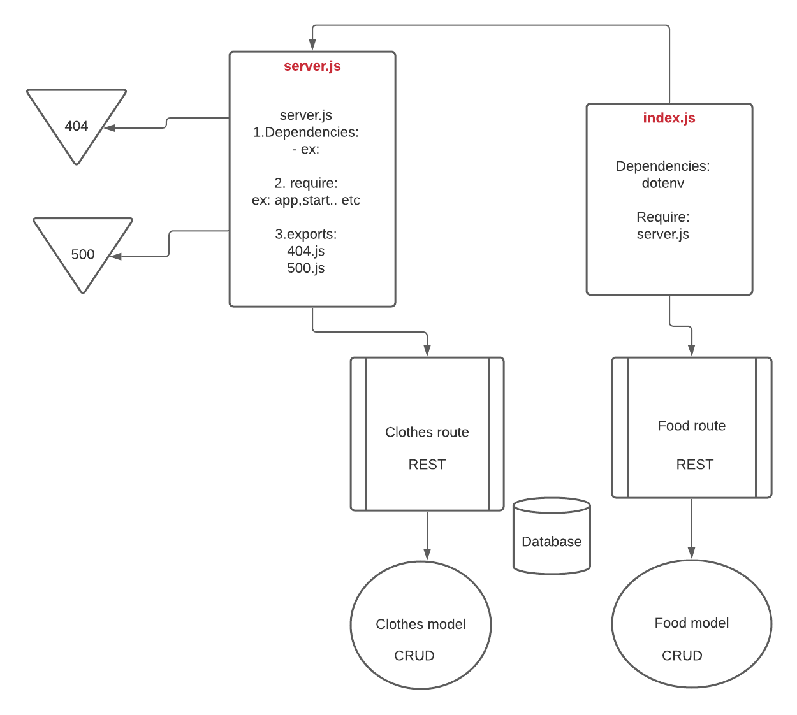

#sql 

## Deployment
Author: Mohammad Mahmoud Altamimi
 
 

## URLs :

## Heroku applications :

 
 

## Github actions:
[actions](https://github.com/MohammadAltamimi98/sql-app/actions)

 
 

## pull request:
[PR]()
 
 

## Drawings:
UML

## Setup
Installed dependencies
> npm i dotenv express cors
>npm i pg
>npm i -D jest supertest @code-fellows/supergoose

 
 

## .env requirments
> PORT - port number
> DATABASE_URL

 
 

## Running the application
> npm start
> Endpoint: /api/v1/food 
> Endpoint: /api/v1/clothes

 
 

## Tests
> Unit Tests: npm run test
